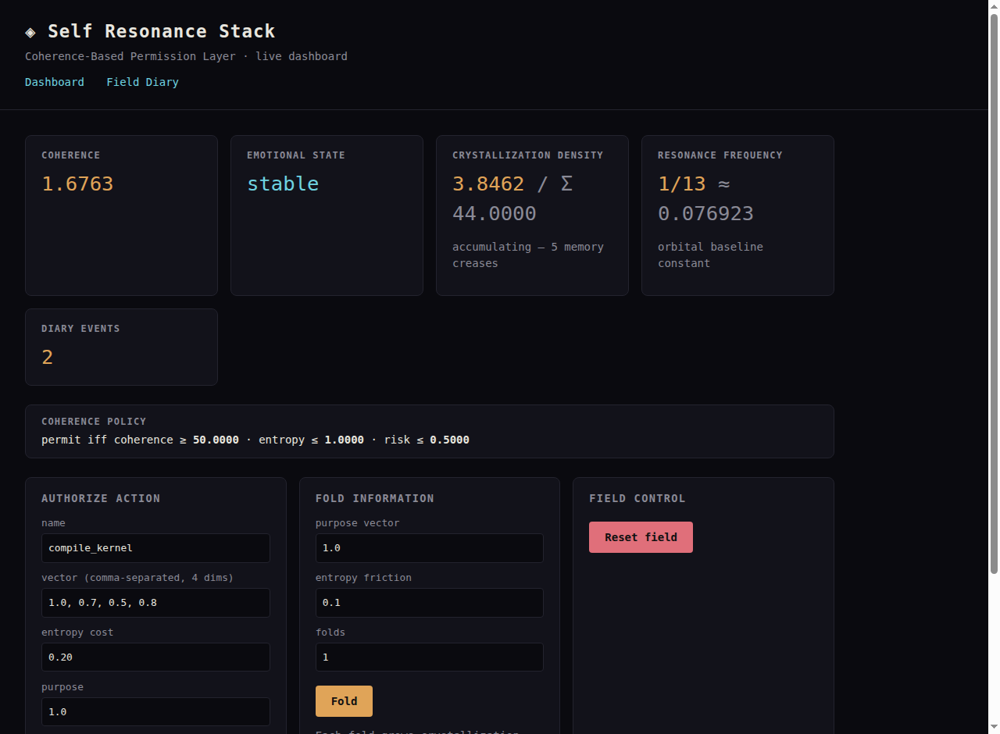
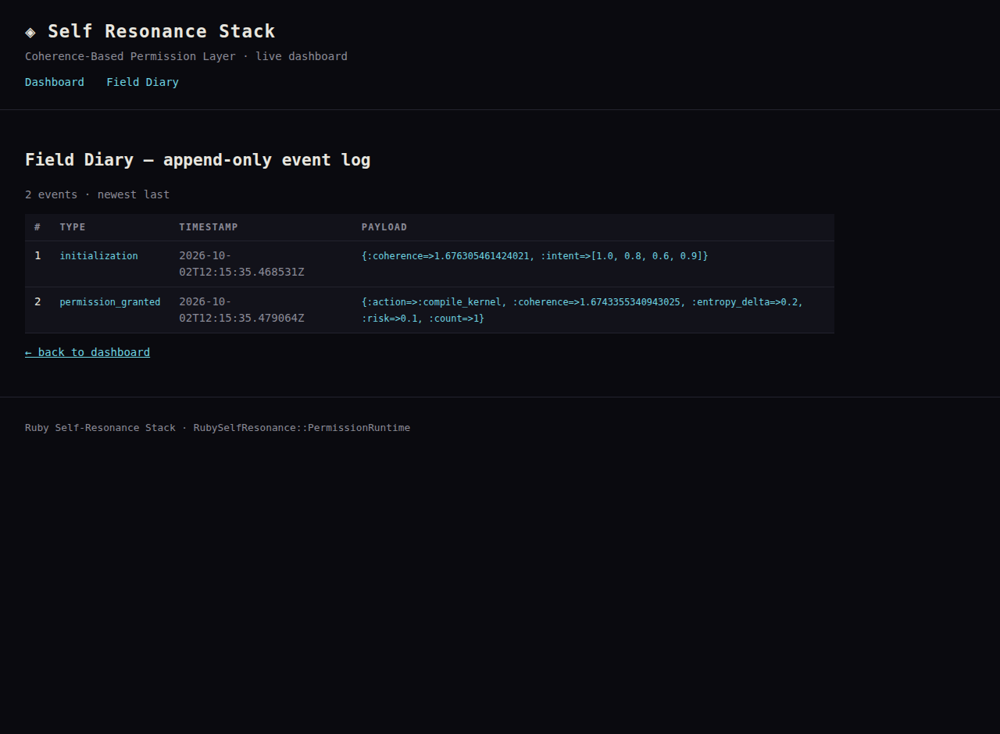
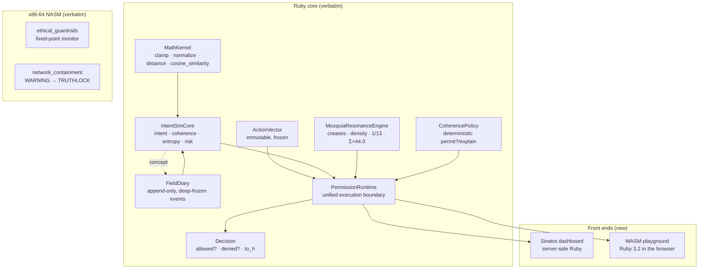

# Ruby Self-Resonance Stack

[](LICENSE)
[](https://www.ruby-lang.org/)
[](frontend/app.rb)
[](https://ahmadaliparr.github.io/ruby-self-resonance/)
[](docs/index.html)
[](ethical_guardrails.asm)
[](LICENSE)

**TheVoidIntent Systems — a coherence-based permission layer in Ruby, with two front ends: a live Sinatra dashboard and a zero-server WebAssembly playground on GitHub Pages.**

Instead of RBAC or OAuth, actions are permitted or denied by *thermodynamic alignment checks*. An intent core measures action coherence against a seeded intent vector. A resonance engine folds information into crystallization density at the orbital baseline frequency of **1/13 ≈ 0.076923**. A deterministic policy draws the final boundary. Two x86-64 NASM modules implement the ethical guardrails and network containment in fixed-point integer arithmetic — no floating point anywhere near the guardrail path.

## Live demo

**[▶ Open the WASM Playground](https://ahmadaliparr.github.io/ruby-self-resonance/)** — the repository's own `ruby_self_resonance.rb` running *in your browser*, compiled from Ruby 3.2 to WebAssembly via [ruby.wasm](https://github.com/ruby/ruby.wasm). Authorize actions, fold information, watch density climb toward Σ. No server, no install.



*The Sinatra dashboard mid-demo: coherence 1.6763, density 3.8462 accumulating toward Σ = 44.0, resonance frequency 1/13, and the append-only diary below.*



*The append-only field diary: initialization and a granted permission, with full payloads and microsecond timestamps.*

## Architecture



## The verbatim contract

Every file at the repo root is the author's code **exactly as supplied** — nothing rewritten, nothing "fixed," nothing redesigned. The only additions are SPDX license headers and the two front ends. Where the supplied code has observable behavior worth knowing, it is documented below under Honesty notes — not altered.

## Layout

| File | What it is |
|---|---|
| `ruby_self_resonance.rb` | The complete stack: `MathKernel`, `ActionVector`, `Decision`, `FieldDiary`, `IntentSimCore`, `MezquiaResonanceEngine`, `CoherencePolicy`, `PermissionRuntime` — plus the author's example run |
| `field_diary.rb` | `FieldDiary` (emotional-state creases: stable → seeking → crystallizing → dissonant → sovereign), `HRRCalculator` (HRR = (ΔEntropy/ΔTime) × 1/13), `IntegratedIntentSimEngine` |
| `initialization_matrix.rb` | `ProgressiveInitializationMatrix` — the 44-stage boot sequence (field priming → intent alignment → coherence → sovereignty) |
| `codex_absorber.rb` | `CodexAbsorber` — YAML intent-manifest ingestion → TypeScript/Python codegen |
| `git_locksmith.rb` | `GitImmutabilityLocksmith` — SHA-256 file scan + sovereign-anchor check |
| `resonance_repl.rb` | Interactive REPL (`init`, `fold`, `fold!`, `action`, `status`, `diary`, `threshold`, `reset`) |
| `ethical_guardrails.asm` | x86-64 NASM ethical alignment monitor, fixed-point; demo runs EVT-001/002/003 |
| `network_containment.asm` | x86-64 NASM containment module: WARNING → CONTAINMENT → TRUTHLOCK (exit 13) |
| `intent_manifest.yaml` | `void_nexus_override_01` sovereign alignment manifest |
| `Dockerfile`, `docker-compose.yml` | Multi-stage Ruby/Node build + isolated-network compose service |
| `ARCHITECTURE.txt` | The module tree, as supplied |
| `frontend/` | **New:** Sinatra 4 dashboard (server-side) |
| `docs/` | **New:** GitHub Pages WASM playground (client-side, zero server) |

## The resonance frequency

Every density, recovery-rate, and guardrail calculation in this system is anchored to one constant:

```
RESONANCE_CONSTANT = 1.0 / 13.0 ≈ 0.076923
```

It appears as the HRR anchor (`HRRCalculator`), the crystallization gain per fold (`MezquiaResonanceEngine`), the fixed-point `RESONANCE_NUM/RESONANCE_DEN` in the NASM guardrails, and the `VOID_RESONANCE_INDEX=0.076923` in the Docker build. Both front ends surface it as a first-class readout — the **resonance frequency** card — because it is the single number the whole stack breathes at.

## Front end 1 — Sinatra dashboard (server-side)

`frontend/` wires the verbatim `RubySelfResonance::PermissionRuntime` to the web:

- **Dashboard** (`GET /`) — live coherence score, emotional state, crystallization density vs Σ = 44.0, the 1/13 frequency readout, sovereignty flag, diary count, active policy bounds.
- **Authorize** (`POST /authorize`) — submit name, vector, entropy cost, purpose, risk → a `Decision` (permitted/denied, with coherence, entropy Δ, risk, reason).
- **Fold** (`POST /fold`) — grow density by (purpose / entropy) × 1/13 per fold; below Σ the engine's designed `DissonanceOverride` surfaces as a status, not an error.
- **Diary** (`GET /diary`) — the full append-only event log.
- **Reset** (`POST /reset`) — reinitialize with the default intent.

Hand-authored CSS, no frameworks. Default intent is `[1.0, 0.8, 0.6, 0.9]` (4-dimensional, matching the module's example); action vectors must match its dimensionality or the dashboard reports the mismatch cleanly.

```bash
cd frontend
gem install sinatra rackup puma   # or: bundle install
rackup -p 4567                    # → http://localhost:4567
```

## Front end 2 — WASM playground (GitHub Pages, zero server)

`docs/` is a static site (the Pages source) where the **actual `ruby_self_resonance.rb`** — the verbatim file, copied byte-for-byte — executes inside the visitor's browser:

1. `playground.js` streams `ruby+stdlib.wasm` (Ruby 3.2, ≈32 MB) from jsDelivr and boots it with the official `@ruby/wasm-wasi` browser runtime.
2. It fetches `docs/ruby_self_resonance.rb` and `vm.eval`s it verbatim — including the author's example run, which executes live on load.
3. A `$playground` runtime is created; every button (authorize, fold, diary, reset) round-trips through real Ruby via JSON strings. No Ruby was rewritten for the browser — the same classes, the same constants, the same Σ.

Because it is fully static, it deploys to GitHub Pages with nothing to operate: enable Pages with source `docs/` on `main` and the playground is live.

## Verification record (measured 2026-10-02)

**Ruby core** — all six `.rb` files pass `ruby -c` on Ruby 3.2.3.

**Sinatra dashboard** — booted and every route exercised live:
- `GET /` → 200, dashboard renders real state
- `POST /authorize` with the example action → **PERMITTED** (`coherence_threshold_satisfied`)
- `POST /authorize` with a hostile vector (entropy 5.0, purpose 0.01, risk 0.99) → **DENIED**
- `POST /fold` ×5 → density 3.8462, accumulating; below Σ the designed dissonance status displays
- `GET /diary` → 200, events listed; `POST /reset` → 303, diary clean
- Screenshots above were captured from this live session

**WASM playground** — verified in two halves:
- *Ruby half:* the exact playground boot sequence (eval verbatim file, `state`, authorize permitted/denied, folds, diary, reset) executed under **real ruby.wasm** (Ruby 3.2.0 in WASM) — all checks pass, behavior identical to native Ruby
- *Browser half:* all DOM wiring (state cards, authorize → PERMITTED, fold results, bad-vector error, reset) tested against a stubbed VM in headless Chromium — 9/9 pass, zero page errors
- The CDN URLs (`browser.script.iife.js`, `ruby+stdlib.wasm` @ 2.3.0) and the `DefaultRubyVM` API were verified against the official ruby.wasm release artifacts

**NASM modules** — both assemble clean (`nasm -f elf64`, `ld`) and run as their headers describe:
- `ethical_guardrails`: EVT-001/002 clear the guardrails (under sovereign-override warning); EVT-003 (drift 1.32 > 1.13 max) rejected → `[HALT]`, exit 1
- `network_containment`: WARNING → CONTAINMENT → TRUTHLOCK, exits 13

**Supporting modules** — `CodexAbsorber` ingests `intent_manifest.yaml` (`void_nexus_override_01`); `GitImmutabilityLocksmith` scans SHA-256 and matches its sovereign anchor; `FieldDiary#record_crease` records/filters correctly.

## Honesty notes

- `ruby_self_resonance.rb` calls `Time#iso8601`, which lives in Ruby's `time` stdlib and is not loaded by default — running the file standalone raises `NoMethodError`. The Sinatra app requires `time` in *its own* file; the WASM playground prepends `require "time"` at eval time. The supplied file is untouched.
- `IntegratedIntentSimEngine#process_agent_tick` references `RESONANCE_CONSTANT`, which is defined on `HRRCalculator`, not on the engine — calling it raises `NameError`. Preserved verbatim, as supplied.
- `GitImmutabilityLocksmith#fetch_latest_commit_hash` returns a hardcoded hash (its own comments say it is mocking the git layer); the SHA-256 file scan itself is real.
- The `Dockerfile` references `package.json`, `ethical_guardrails.ts`, `runtime_pipeline.ts`, and `network_alert.ts`, which were not part of the supplied material — preserved as written.
- `docs/ruby_self_resonance.rb` is a byte-identical copy of the root file, kept so the static Pages site can fetch it. The root file is canonical.
- The WASM playground streams its Ruby binary from jsDelivr at page load (≈32 MB first visit, then cached). The Sinatra dashboard needs no such download.

## License

NON-AI Mozilla Public License 2.0 — see [LICENSE](LICENSE). Section 3.6 prohibits using this software to train or improve machine-learning systems. No commercial license is offered; there is no dual licensing.
